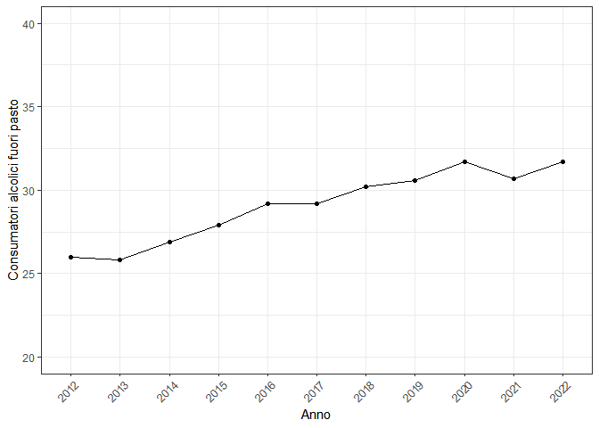
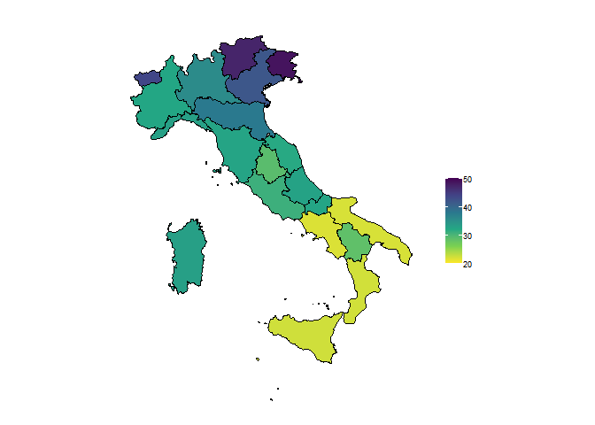
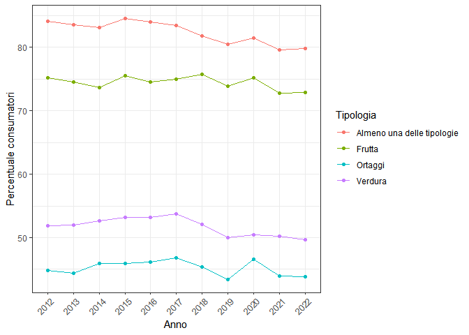
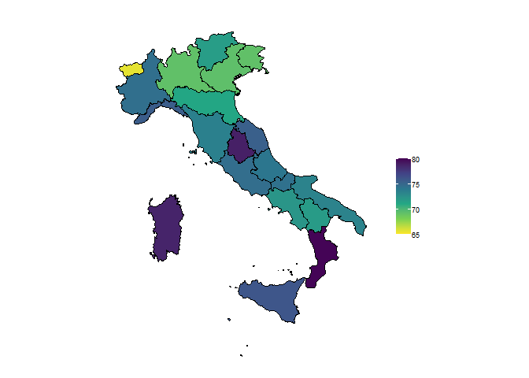

In questa pagina sono presenti delle ulteriori considerazioni su altri
fattori di rischio modificabili per la salute. In particolare, viene
valutato il consumo di alcol (nello specifico quello fuori dai pasti), e
viene approfondita la tematica del consumo di verdura, frutta e ortaggi.

## Consumo di alcolici

#### Andamento consumo alcolici fuori pasto

Figura 1: Consumo alcolici fuori pasto dal 2012.

Negli ultimi dieci anni il consumo di alcolici fuori pasto è aumentato
di sei punti percentuali. Questo porta ad alcolemia elevata ed è
associato a numerosi effetti cronici nocivi.

### Mappa consumo alcol

Figura 2: Numero di individui che consumano alcol fuori pasto nel 2022,
per 100 persone con le stesse caratteristiche.

Con riferimento al 2022, si notano delle differenze significative nel
consumo di alcol fuori dai pasti nelle diverse regioni. Risulta infatti
che nelle regioni del Mezzogiorno ci sia una minore propensione degli
abitanti a bere alcol fuori dai pasti, mentre specialmente in Trentino
Alto Adige, in Valle d’Aosta e in Friuli Venezia Giulia le percentuali
sono più elevate, arrivando a sfiorare il 50%.

### Consumo verdure, frutta ed ortaggi

#### Andamento consumo verdure, frutta ed ortaggi

Figura 3: Andamento del consumo di verdure, ortaggi e frutta.

Il consumo di almeno una delle tre tipologie considerate è diminuito del
4% nell’ultimo decennio, particolarmente evidente la discesa del consumo
di verdure dal 2017 ad oggi.

### Mappa consumo frutta

Figura 4: Numero di individui che consumano almeno una frutta al giorno
nel 2022, per 100 persone con le stesse caratteristiche.

Dalla figura si nota che il consumo di frutta è in generale più elevato
rispetto al consumo di verdure e ortaggi, in tutto il Paese. In Umbria,
Calabria e Sardegna la percentuale di individui che consuma almeno una
porzione di frutta ogni giorno è la più elevata, arrivando quasi
all’80%. Viceversa, Valle d’Aosta, Lombardia, Veneto e Friuli Venezia
Giulia registrano le percentuali inferiori, attestandosi tra il 65 e il
70%.
